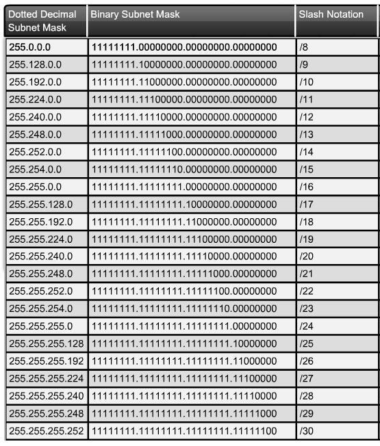

# MODUL 2 - IP ADDRESS, SUBNETTING, DAN CIDR

## Tujuan Modul

-   Paham perbedaan IP publik dan privat
-   Bisa membaca dan menghitung subnet secara manual
-   Mengerti CIDR (/24, /26, dst.) dan penggunaannya

## 2.1 IP Address

IP address adalah identitas logis perangkat dalam jaringan. Ada dua versi:

1. IPv4

    - Contoh : 192.168.1.1
    - Panjang : 32 bit
    - Format : 4 oktet

2. IPv6
    - Contoh : 2001:db8::1
    - Panjang : 128 bit
    - format : hexadesimal

## 2.2 IP Publik vs IP Privat

Ada dua jenis IP, yaitu IP publik dan IP privat.

### 1. IP Publik

-   Adalah IP address yang digunakan untuk komunikasi antar host di internet global, yang penggunaan dan alokasinya diatur oleh beberapa lembaga, di mana otoritas tertinggi dipagang oleh IANA (Internet Assigned Numbers Authority)
-   Didapatkan dari penyedia layanan internet atau ISP
-   IP publik digunakan sebagai identitas kita di internet, maka dari itu, IP ini bisa diakses melalui jaringan internet secara langsung.

Berikut ini range IP publik:

-   Class A : 1.0.0.0 - 126.0.0.0
-   Class B : 128.0.0.0 - 191.0.0.0
-   Class C : 192.0.0.0 - 223.0.0.0
-   Class D (Multicast) : 224.0.0.0 - 239.0.0.0
-   Class E (For Research): 240.0.0.0 - 255.0.0.0

Contoh dari IP Public:

-   1.1.1.1 (IP DNS Cloudflare)
-   8.8.8.8 (IP DNS Google)

### 2. IP Private

-   Adalah IP address yang hanya dikenali di jaringan lokal
-   Berguna untuk membuat jaringan lokal
-   Perlu router yang memiliki IP Publik untuk menghubungkan ke internet

Berikut ini range IP private:

-   Class A : 10.0.0.0 - 10.255.255.255
-   Class B : 172.16.0.0 - 172.31.255.255
-   Class C : 192.168.0.0 - 192.168.255.255

## 2.3 Subnetting

`Subnetting` adalah proses membagi jaringan besar menjadi jaringan yang lebih kecil. Tujuannya adalah efisiensi IP dan pemisahan segment agar tidak banyak IP yang tersisa.

Contoh:

IP 192.168.1.0/24 memiliki 254 host. Jika hanya butuh 126 host, maka seharusnya menggunakan IP 192.168.1.0/25 saja agar tidak banyak yang tersisa.

## 2.4 CIDR Notation (/xx)

CIDR adalah singkatan dari Classless Inter-Domain Routing. CIDR adalah cara penulisan subnet mask dari sebuah subnet dengan cara mengubah notasi sub network dari desimal ke biner kemudian menghitung jumlah total nilai biner 1 yang ada.

`/24` artinya 24 bit bagian network, sisanya host.

Banyaknya host dalam CIDR dihitung dengan rumus:

```
host = 2^(32 - /xx) - 2
```

nilai dikurangi dua karena akan digunakan untuk Network ID dan Broadcast Address.

Contoh:

Misal kita menghitung jumlah host dalam CIDR `/26`, maka jumlah hostnya adalah:

```
host = 2^(32 - 26) - 2
host = 2^6 - 2
host = 64 - 2
host = 62
```

Nantinya, pemakaian IP addressnya akan seperti ini:

-   Network ID : 192.168.1.0
-   Host ID : 192.168.1.1 - 192.168.1.62
-   Broadcast ID : 192.168.1.63
-   Subnet Mask : 255.255.255.192

Subnet Mask dihitung dengan cara:

```
Subnet Mask = 256 - jumlah total host
```

Dari contoh yang sebelumnya, 256 - 64 = 192. Maka Subnet Masknya 255.255.255.192

Berikut ini tabel CIDR:

| CIDR | Jumlah IP | IP Host |
| :--: | :-------: | :-----: |
| /30  |     4     |    2    |
| /29  |     8     |    6    |
| /28  |    16     |   14    |
| /27  |    32     |   30    |
| /26  |    64     |   62    |
| /25  |    128    |   126   |
| /24  |    256    |   254   |


